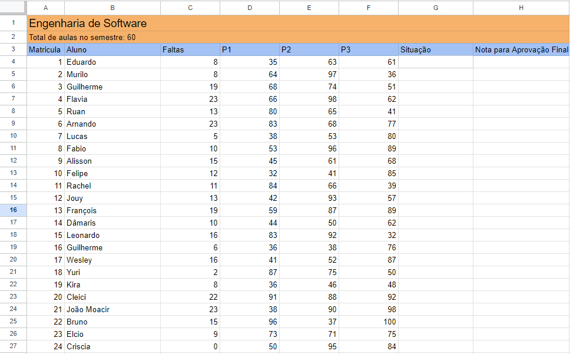
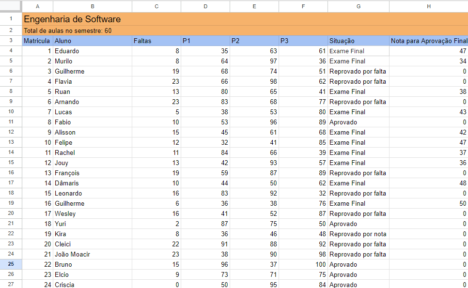

THE SPREADSHEET SHOULD LOOK LIKE THIS IN THE BEGINNING

ATTENTION: YOU NEED NODE.JS AND NPM TO PROCEED AND EXECUTE THE SCRIPT

IF YOU ALREADY HAVE IT, SKIP THE STEP 1.

1. INSTALL NODE.JS AND NPM
   
2. EXECUTE THIS ON THE TERMINAL
"npm install googleapis@105 @google-cloud/local-auth@2.1.0 --save"

4. THEN EXECUTE
"NODE ." (PAY ATTENTION TO THE DOT(.))

THE SCRIPT WILL AUTOMATICALLY START.
YOU MAY HAVE TO LOG IN WITH YOUR GOOGLE ACCOUNT, MAKE SURE YOU HAVE THE SPREADSHEET OPEN.

LINK TO THE SPREADSHEET: 
https://docs.google.com/spreadsheets/d/1eeDc8ZY3hkKcAvx-apkCBipWEAzcX53z5u5VLFqDLvc/edit#gid=0

AFTER THE SCRIPT ENDS THE SPREADSHEET SHOULD LOOK LIKE THIS:

